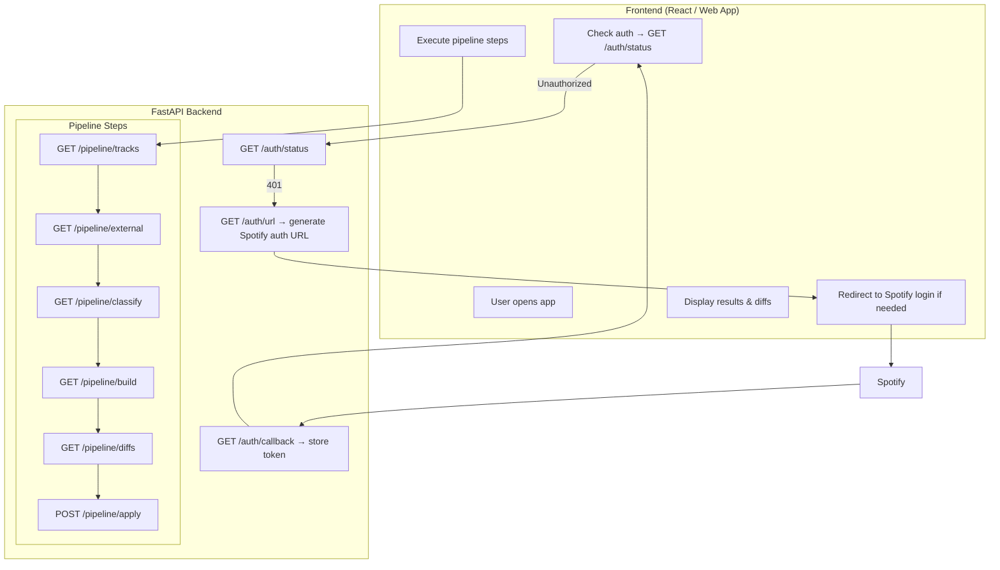

# 🎧 Spotify Auto-Playlists — API-Driven Version

Generate and maintain smart Spotify playlists using external intelligence sources
(MusicBrainz + AcousticBrainz), now fully exposed through a clean HTTP API.

This backend is **front‑driven**:  
- The **frontend handles user redirect to Spotify**
- Spotify calls backend `/auth/callback`
- Backend stores token + performs pipeline operations

No CLI interaction anymore.

---

## 🚀 Overview

This backend provides an HTTP API that exposes the entire playlist‑building workflow:

1. **Authentication**
   - `/auth/status`
   - `/auth/url`
   - `/auth/callback` (Spotify redirects user here)
   - backend stores the token in `/cache/spotify_token.json`

2. **Fetch user data**
   - `/pipeline/tracks` → Liked Tracks
   - `/pipeline/playlists` → Existing Spotify playlists

3. **Enrich tracks with external intelligence**
   - `/pipeline/external`
   - Parallel MusicBrainz + AcousticBrainz lookup
   - Cached in `/cache/external_features.json`

4. **Classify tracks**
   - `/pipeline/classify`
   - Rule‑based mood inference: workout, chill, focus…

5. **Generate playlists**
   - `/pipeline/build`

6. **Preview diffs**
   - `/pipeline/diffs`
   - Diff files written to `/cache/diffs/*.diff`

7. **Apply changes**
   - `/pipeline/apply`
   - Incremental write to Spotify playlists

---

# 🧭 Pipeline Architecture (Mermaid)



---

# 🗂 Folder Structure

```
app/
  api/
    fastapi_app.py
    auth.py
    pipeline_tracks.py
    pipeline_external.py
    pipeline_classification.py
    pipeline_playlists.py
  pipeline/
    orchestration.py
    classifier.py
    external_features.py
    playlist_manager.py
    cache_manager.py
  spotify/
    auth.py
    tracks.py
    playlists.py
  core/
    logging_utils.py
    logging_config.py
    fs_utils.py
    models.py
  config.py
api_main.py
```

NOTE:  
`main.py` is deprecated and no longer used.

---

# 🛠 Setup

## 1. Install dependencies

```
python -m venv .venv
source .venv/bin/activate
pip install -r requirements.txt
```

## 2. Environment variables

Create `.env`:

```
SPOTIFY_CLIENT_ID=xxxx
SPOTIFY_CLIENT_SECRET=xxxx
SPOTIFY_REDIRECT_URI=http://127.0.0.1:8888/auth/callback

MUSICBRAINZ_USER_AGENT=spotify-auto-playlists/1.0 (email@example.com)
```

⚠ You must also configure the same redirect URI in the Spotify Developer Dashboard:
https://developer.spotify.com/dashboard

---

# ▶ Run the server

```
uvicorn api_main:app --reload --port 8888
```

---

# 🔌 API Overview

## Authentication

### `GET /auth/status`
Returns 200 or 401.

### `GET /auth/url`
Returns the Spotify authorization URL.

### `GET /auth/callback`
Spotify redirects here after login.  
Backend stores token and returns success.

---

## Pipeline

### `GET /pipeline/tracks`
Fetch user liked tracks (cached).

### `GET /pipeline/external`
Parallel external feature fetching (cached & incremental).

### `GET /pipeline/classify`
Rule-based mood classification.

### `GET /pipeline/build`
Return playlists grouped by mood/genre/year.

### `GET /pipeline/diffs`
Build diff objects + write .diff files.

### `POST /pipeline/apply`
Apply playlist updates to Spotify.

---

# ✔ Frontend Responsibilities

- Redirect user to Spotify login  
- Orchestrate pipeline step by step  
- Display loading, progress, diffs, playlist proposals  
- Call `/pipeline/apply` when user approves

Backend is pure logic + cached data.

---

# 📦 Caching

All caches live in `/cache/` (at project root):

```
cache/
  tracks.json
  external_features.json
  spotify_token.json
  diffs/
```

---

# 🎉 Done

The backend is now fully API-driven and ready for a modern UI.
