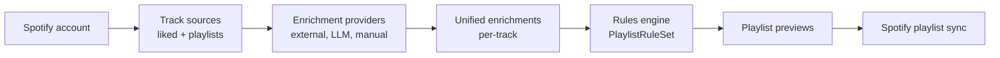
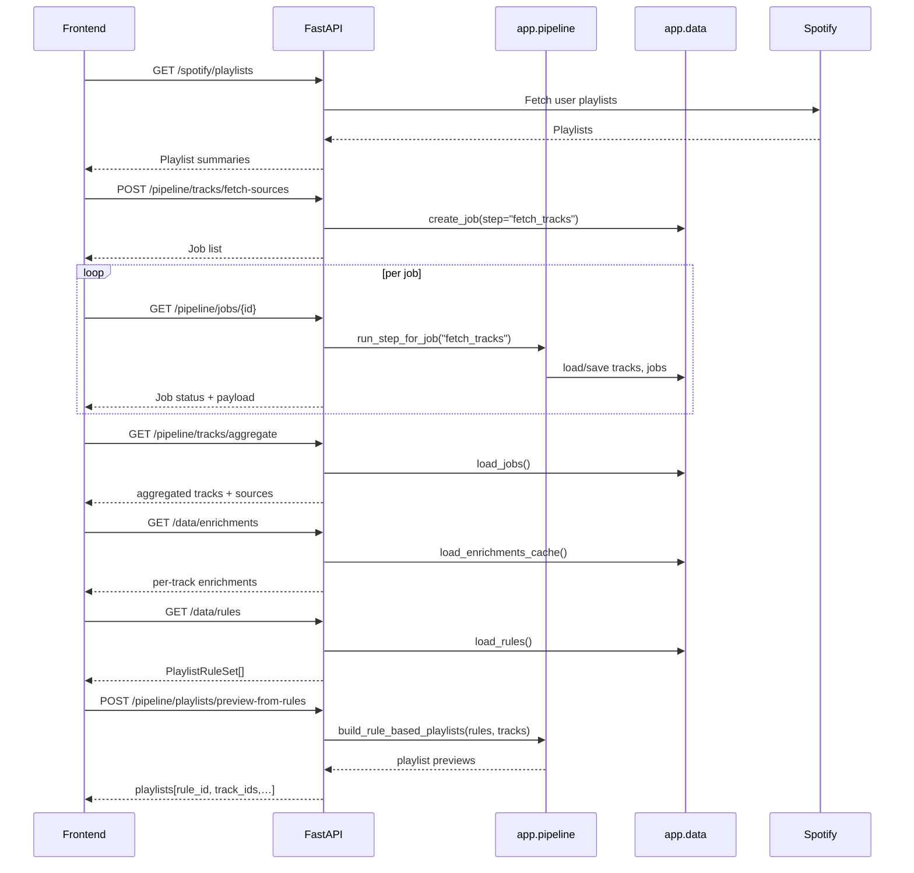

# System Architecture – spotify-auto-playlists

This document gives a **big-picture view** of the project:

- what the system does,
- how the backend is structured,
- how the (planned) frontend will talk to it,
- how the main flows fit together.

The goal is to keep this file **stable and high level**; detailed behaviour
belongs in the backend, frontend, and rules/enrichment docs.

---

## 1. Product Overview

`spotify-auto-playlists` is a local tool that helps a Spotify user:

1. Fetch tracks from multiple sources (liked tracks + selected playlists).
2. Enrich these tracks using various providers (external APIs today,
   LLM / manual enrichers tomorrow).
3. Define **rules** (a small DSL) that describe how tracks should be grouped
   into playlists.
4. Preview which tracks would land in which playlists.
5. Eventually synchronise those playlists back to Spotify.

At a high level:

---

## 2. High-Level Components

### Legacy Pipeline (v1) and Rules-based Pipeline (v2) Coexistence

Both the legacy pipeline (v1) and the new rules-based pipeline (v2) are present in the backend:

- **Why both exist**: v1 provides the original synchronous and job-based flows, while v2 introduces a rules-based, multi-source, and job-per-source approach.
- **Roles**: v1 is relied on by the smoke test and for legacy compatibility; v2 is the intended target for the frontend and new features.
- **UI usage**: The frontend will use the rules-based pipeline (v2).
- **Smoke test**: The smoke test exercises both v1 and the v2 `fetch_tracks` step.

### Dual Job System

- `/pipeline/{step}/run-async`: legacy generic job runner (v1).
- `/pipeline/tracks/fetch-sources`: v2 job generator, returns multiple jobs (one per source).
- Both systems coexist intentionally and may converge in the future.

The project is intentionally modular:

- **API layer** (`app.api`)
  - FastAPI application and routers (`/pipeline`, `/data`, `/auth`, `/spotify`).
  - Only thin request/response logic; delegates to pipeline/data/spotify layers.

- **Pipeline layer** (`app.pipeline`)
  - Pure business logic around tracks, enrichments, playlist building,
    and async job execution.
  - Multi-source track fetching (`fetch_tracks` step).
  - External feature enrichment (MusicBrainz / AcousticBrainz).
  - Rules engine (`matches_rules`, `build_enrichment_view`).
  - Rule-based playlist preview (`build_rule_based_playlists`).

- **Data layer** (`app.data`)
  - JSON-backed storage for:
    - tracks, external features, classifications,
    - unified enrichments,
    - playlist rules,
    - async jobs.
  - Provides **façades** for loading/saving data in a safe, atomic way.

- **Core layer** (`app.core`)
  - Cross-cutting concerns:
    - logging utilities and configuration,
    - filesystem helpers (`write_json`, `read_json`),
    - basic models (`Track`, `Classification`, `TrackEnrichment`),
    - rules models (`PlaylistRuleSet`, `RuleGroup`, etc.).

- **Spotify integration** (`app.spotify`)
  - OAuth and token management.
  - Track and playlist helpers:
    - liked tracks (`get_all_liked_tracks`),
    - listing playlists (`list_user_playlists`),
    - reading playlist tracks,
    - applying playlist changes (diff/apply pipeline).
  - `TrackSource` / `TrackSourceType` abstraction for describing sources.

- **Scripts** (`scripts/smoke.py`)
  - Full end-to-end functional smoke test.
  - Treat this as the main **non-regression contract** of the system.

---

## 3. Backend–Frontend Responsibilities

The system is deliberately **front-driven**: the backend exposes detailed
endpoints, and the frontend orchestrates flows from these primitives.

- Backend responsibilities:
  - Provide stable, well-documented HTTP APIs.
  - Persist data locally in atomic JSON files.
  - Run long-running work in background jobs.
  - Offer utility endpoints to support UX (e.g. rules validation, previews).

- Frontend responsibilities (planned):
  - Handle Spotify login flow.
  - Let the user choose track sources and monitor async jobs.
  - Display tracks + enrichments with rich filtering and selection.
  - Provide a rule builder UI on top of the rules DSL.
  - Visualise playlist previews and diffs.
  - Offer a safe, explicit “apply to Spotify” flow.

---

## 4. Data & Job Persistence

All persistence uses **JSON files** stored under a local cache directory
(`CACHE_DIR`). Writes are always **atomic**:

- `write_json(path, data)`:
  - writes to a temporary file in the same directory,
  - flushes + `fsync` the file descriptor,
  - uses `os.replace` to atomically replace the target path.
- `read_json(path, default=...)`:
  - returns `default` if the file does not exist or is corrupted.

Job persistence:

- Jobs live in `jobs.json` (through `app.data.jobs`).
- Each job has:
  - `id`, `step`, `status`, `created_at`, `updated_at`,
  - optional `message`, `progress`, `payload`,
  - `metadata` (e.g. track source info for `fetch_tracks`).
- The job runner (`run_step_for_job`) is deterministic and small, so it can
  be easily smoke-tested and extended.

---

## 5. Extension Points

The current architecture is already prepared for future extensions:

- **Enrichment providers**
  - New providers (LLM / manual) should write `TrackEnrichment` entries
    via `save_enrichments_cache()`.
  - The rules engine only depends on the flattened enrichment view, so
    it works transparently with new providers.
  - **TrackEnrichment[] is internal storage**: The backend stores enrichments as a list of `TrackEnrichment` entries per track. The rule engine operates on a flattened dictionary view of these enrichments. The frontend can provide its own flattening logic and is not required to use the backend's `TrackEnrichment` model.

- **Rules engine**
  - The DSL is defined centrally in `app.core.rules` and implemented in
    `app.pipeline.rules_engine`.
  - New operators can be added there without touching the rest of the system.

- **Track sources**
  - `TrackSource` / `TrackSourceType` allow for other sources beyond liked
    and playlist tracks if needed (e.g. “radio” / “recommendations”). 

- **Frontend**
  - Any React/TS SPA (or other modern UI stack) can be added on top of the
    documented APIs without changing backend internals.

See the dedicated backend, frontend, and roadmap documents for more detailed views.
