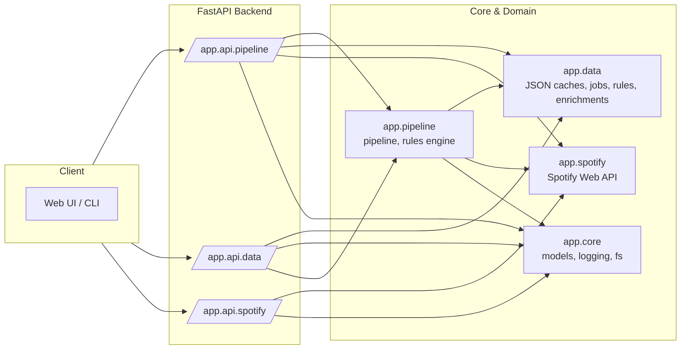

# spotify-auto-playlists – Backend Architecture

This document describes the current backend architecture of the `spotify-auto-playlists` project,
as of the rules engine & playlist rules API (up to Sprint 11).

The backend is a FastAPI application designed to:
- fetch tracks from Spotify (liked tracks and playlists),
- enrich tracks using external providers and future LLM-based enrichers,
- store unified enrichments in a JSON-backed cache,
- expose a flexible rule system to classify tracks into playlists,
- support async jobs for long-running operations.

## High-level components

- **app/api**: FastAPI routers (HTTP surface).
- **app/core**: core models, logging, filesystem utils, rule models.
- **app/data**: JSON-backed caches (tracks, classifications, jobs, enrichments, rules).
- **app/spotify**: Spotify Web API integration (auth, tracks, playlists).
- **app/pipeline**: pipeline orchestration, external features, rules engine, jobs runner.
- **scripts/smoke_test.py**: end-to-end functional smoke test.

## Package responsibilities

### app.core

Cross-cutting primitives:

- `Track` (dataclass) – core track representation.
- `Classification` – simple classification model.
- `TrackEnrichment` (Pydantic) – unified enrichment entry for a track.
- Rule models:
  - `ConditionOperator`, `LogicalOperator`
  - `RuleCondition`, `RuleGroup`, `PlaylistRuleSet`
- Logging helpers: `log_info`, `log_step`, `log_warning`, `log_error`, `log_progress`, `log_success`.
- Filesystem helpers: `read_json`, `write_json`, `ensure_dir`, `ensure_parent_dir`.
- Logging configuration: `configure_logging`.

All of these are exposed via the façade:

```python
from app.core import Track, TrackEnrichment, PlaylistRuleSet, log_info, write_json
```

### app.data

JSON-backed persistence and caches:

- Track caches (tracks and external features).
- Classification caches.
- Unified enrichment cache (`enrichments.json`).
- Playlist rules cache (`rules.json`).
- Pipeline jobs metadata (async jobs).

Key façade helpers (non-exhaustive):

```python
from app.data import (
    load_tracks_cache, save_tracks_cache,
    load_external_features_cache, save_external_features_cache,
    load_classification_cache, save_classification_cache,
    load_enrichments_cache, save_enrichments_cache,
    load_rules, save_rules,
    PipelineJob, PipelineJobStatus,
    create_job, get_job, update_job, load_jobs, save_jobs,
    TracksRepository, ClassificationRepository,
)
```

The JSON writes are atomic and robust against partial writes thanks to `write_json`.

### app.spotify

Spotify Web API integration:

- Authentication, token management, user id retrieval.
- Liked tracks fetch.
- Playlist listing, reading, and incremental updates.
- `TrackSource` and `TrackSourceType` describe logical sources of tracks
  (liked tracks vs playlists).

Everything is consumed via the façade:

```python
from app.spotify import (
    SpotifyTokenMissing,
    build_spotify_auth_url,
    load_spotify_token,
    get_all_liked_tracks,
    list_user_playlists,
    get_playlist_tracks,
    incremental_update_playlist,
    TrackSource, TrackSourceType,
)
```

### app.pipeline

Pipeline orchestration and domain logic:

- External features enrichment (`external_features` module).
- Cache management (`cache_manager`).
- Playlist building and diffing (`playlist_manager`, `reporting`).
- Async job runner (`jobs_runner`).
- Track source management (`sources_manager`).
- Rule engine (`rules_engine`).

The façade exports:

```python
from app.pipeline import (
    PipelineOptions,
    load_tracks_cache, save_tracks_cache,
    load_external_features_cache, save_external_features_cache,
    classify_tracks_rule_based,
    build_target_playlists, preview_playlist_diffs, sync_playlists,
    write_unmatched_report,
    run_step_for_job,
    fetch_tracks_for_source,
    build_enrichment_view, matches_rules,
)
```

### app/api

FastAPI routers grouped by domain:

- `/pipeline/*` – pipeline steps (tracks, external, classify, build, diff), jobs, multi-source fetch.
- `/data/*` – data API for tracks, classifications, enrichments, and rules.
- `/auth/*` – Spotify auth glue.
- `/spotify/*` – user playlists listing and related Spotify-facing endpoints.

Routers are wired in `app/api/fastapi_app.py` with clear tags:
- `pipeline`, `pipeline-jobs`, `data`, `auth`, `spotify`.

## Async jobs and multi-source fetching

The project uses a JSON-backed job store to track async pipeline steps.

Typical flow:

1. Client calls `POST /pipeline/tracks/fetch-sources` with a list of logical sources.
2. Backend creates one job per source (`step="fetch_tracks"`), with metadata describing the source.
3. Background tasks run `run_step_for_job("fetch_tracks", metadata)` which delegates to
   `fetch_tracks_for_source()` and serialises results into the job payload.
4. The client polls jobs via `/pipeline/jobs/{job_id}` or aggregates results via
   `GET /pipeline/tracks/aggregate`.

This design is ready to support:

- different types of sources (liked tracks, playlists, later: folders, saved albums, etc.),
- multiple enrichment passes,
- future rule-based playlist building.

## Mermaid overview


