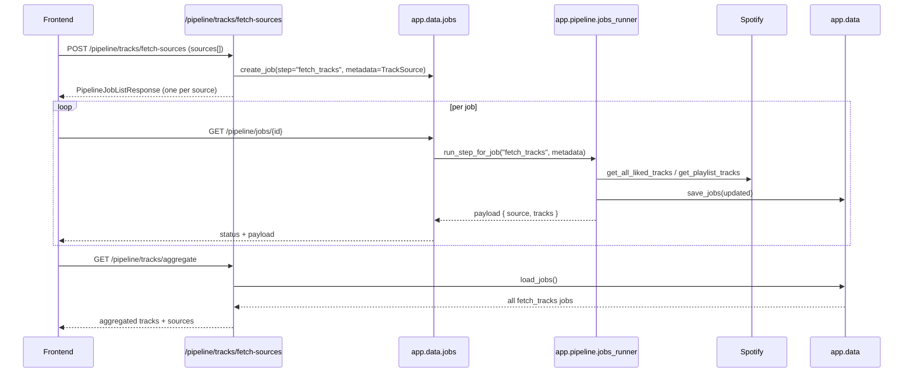

# Backend Overview – spotify-auto-playlists

This document is aimed at backend developers who want to work inside the
codebase. It complements the high-level architecture document and focuses
on **packages, flows, and key behaviours**.

---

## 1. Package Layout

```text
app/
  api/          # FastAPI routes and schemas
  core/         # logging, fs helpers, basic models, rules DSL
  data/         # JSON-backed persistence & repositories
  pipeline/     # business logic and orchestration
  spotify/      # Spotify Web API integration
scripts/
  smoke.py # end-to-end functional test
```

### 1.1 API Layer (`app.api`)

- `fastapi_app.py`
  - Creates the FastAPI `app` and wires routers with prefixes & tags.

- `app/api/pipeline/*`
  - `health.py` – pipeline health check.
  - `tracks.py` – legacy synchronous tracks step.
  - `external.py` – external feature enrichment step.
  - `classify.py` – rule-based / classification steps.
  - `playlists.py` – playlist build endpoints + rule-based preview.
  - `diff.py` – diff endpoint vs Spotify.
  - `jobs.py` – async job creation and status APIs.
  - `multi_sources.py` – multi-source track fetch + aggregation.

- `app/api/data/routes.py`
  - `/data/tracks` – list and paginate cached tracks.
  - `/data/features/{provider}` – external features (legacy).
  - `/data/classifications/{classifier}` – read classification cache.
  - `PATCH /data/classifications/{classifier}/{track_id}` – edit labels.
  - `/data/enrichments` – unified per-track enrichments.
  - `/data/rules` – read & upsert playlist rules.
  - `/data/rules/evaluate` – dry-run a `RuleGroup` against an enrichment map.
  - `/data/rules/validate` – validate rule structure.

- `app/api/spotify/*`
  - `playlists.py` – `GET /spotify/playlists` (simplified playlist summaries).

All API modules should remain **thin**, delegating real work to `app.pipeline`,
`app.data`, and `app.spotify` via their façades.

### 1.2 Core Layer (`app.core`)

- `logging_config.py` / `logging_utils.py`
  - Configure logging; provide `log_info`, `log_step`, `log_warning`, etc.

- `fs_utils.py`
  - `ensure_dir`, `ensure_parent_dir`
  - `write_json` (atomic write), `read_json` (safe read with default).

- `models.py`
  - `Track` – core track representation (dataclass).
  - `Classification` – basic mood/genre/year classification.
  - `TrackEnrichment` – unified enrichment entry (Pydantic model).

- `rules.py`
  - `ConditionOperator`, `LogicalOperator`
  - `RuleCondition`, `RuleGroup`, `PlaylistRuleSet`
  - This is the **canonical definition** of the rules DSL.

### 1.3 Data Layer (`app.data`)

- `cache.py`
  - Load/save helpers for:
    - tracks,
    - external features,
    - classifications.

- `enrichments.py`
  - `load_enrichments_cache` / `save_enrichments_cache`.
  - Backed by `enrichments.json` with `TrackEnrichment` entries.

- `rules.py`
  - `load_rules` / `save_rules` for `rules.json`.

- `jobs.py`
  - `PipelineJob` dataclass.
  - `PipelineJobStatus` enum.
  - `load_jobs`, `save_jobs`, `create_job`, `get_job`, `update_job`.
  - Handles job metadata for `fetch_tracks` step.

- `repositories.py`
  - `TracksRepository` – simple facade over tracks cache.
  - `ClassificationRepository` – facade over classification cache.

All cross-package access goes through the **façade**: `from app.data import …`.

### 1.4 Pipeline Layer (`app.pipeline`)

- `cache_manager.py` – coordinates loading/saving caches for pipeline steps.
- `external_features.py` – MusicBrainz / AcousticBrainz enrichment.
  - Appends to unified enrichment cache via `_update_enrichment_cache_from_external`.
- `classifier.py` – rule-based classification logic (current mood classifier).
- `playlist_manager.py`
  - Classic build/diff/apply logic for playlists.
  - New `build_rule_based_playlists(rules, tracks)` implementation.
- `rules_engine.py`
  - `build_enrichment_view(entries)` – flatten `TrackEnrichment[]` into a mapping.
  - `matches_rules(enrichment, RuleGroup)` – core evaluation of rules.
- `sources_manager.py`
  - `fetch_tracks_for_source(token_info, TrackSource)`:
    - liked tracks: `get_all_liked_tracks`,
    - playlist: `get_playlist_tracks` + minimal `Track` stubs.
- `jobs_runner.py`
  - `SUPPORTED_STEPS` includes `fetch_tracks` and legacy steps.
  - `run_step_for_job(step, metadata)` dispatches to internal helpers.

### 1.5 Spotify Layer (`app.spotify`)

- `auth.py` – token management, headers, current user id.
- `tracks.py` – liked tracks retrieval.
- `playlists.py` – playlist listing, track reading, and sync helpers.
- `sources.py` – `TrackSourceType`, `TrackSource` dataclass.

Everything is re-exported through the package façade:

```python
from app.spotify import (
    SpotifyTokenMissing,
    build_spotify_auth_url,
    list_user_playlists,
    load_spotify_token,
    TrackSource,
    TrackSourceType,
    get_all_liked_tracks,
    get_playlist_tracks,
    # ...
)
```

---

## 2. Core Flows

### 2.1 Multi-Source Track Fetch



### 2.2 Enrichment & Unified Enrichments

- **External enrichment is optional**: The external enrichment step (e.g. MusicBrainz / AcousticBrainz) is not required for the core pipeline to function. The backend and smoke test do not depend on any external enrichment provider being present; enrichment is additive and optional.

- `external_features` step:
  - uses MusicBrainz / AcousticBrainz to enrich tracks.
  - writes provider-specific cache.
  - calls `_update_enrichment_cache_from_external` to append `TrackEnrichment`
    entries into `enrichments.json`.

- Feature provider registry:
  - `app.pipeline.providers` defines a small abstraction for feature providers.
  - `FEATURE_PROVIDERS` exposes the registered providers (e.g. the AcousticBrainz-backed provider).
  - `get_feature_provider(id)` returns a concrete provider instance by id.
  - `list_feature_providers()` returns a lightweight list of `{id, type, version}` metadata suitable for introspection.

- Unified enrichment view:
  - `/data/enrichments` exposes a simple mapping:
    - `track_id -> [TrackEnrichment-like dicts]`.
  - The rules engine does not care about provider internals; it only sees
    `categories` merged via `build_enrichment_view`.
  - **TrackEnrichment[] is internal storage**: The backend stores enrichments as a list of `TrackEnrichment` entries per track. The rule engine operates on a flattened dictionary view of these enrichments. The frontend can provide its own flattening logic and is not required to use the backend's `TrackEnrichment` model.

### 2.3 Rules & Playlist Preview

- Rules are stored via `load_rules` / `save_rules` and exposed over:
  - `GET /data/rules`
  - `POST /data/rules` (**upsert**: POST always creates or updates a rule set)
  - `POST /data/rules/evaluate`
  - `POST /data/rules/validate`

- **POST /data/rules is an upsert**: The backend always creates or updates a rule set when receiving a POST. The frontend can safely use POST for both save and update operations.

- Rule-based playlist preview:
  - API: `POST /pipeline/playlists/preview-from-rules`.
  - Takes:
    - `rules: PlaylistRuleSet[]`
    - `tracks: [{ "track_id": str, "enrichment": Dict[str, Any] }]`.
  - Delegates to `build_rule_based_playlists` in `playlist_manager`:
    - for each rule, it computes which tracks match via `matches_rules`,
    - returns previews with `rule_id`, `rule_name`, `track_ids`, `track_count`.

---

## 3. Testing – `scripts/smoke.py` and pytest unit tests

The smoke test is the **authoritative functional test**. It currently covers:

- Basic API reachability and `/pipeline/health`.
- Pipeline steps: tracks, external, classify, build, diff.
- Data APIs:
  - `/data/tracks`
  - `/data/enrichments`
  - `/data/rules` (read, write, evaluate, validate)
- Async jobs:
  - legacy `step="tracks"`,
  - the new `step="fetch_tracks"` with multi-source aggregation.
- Rule-based playlist preview:
  - `POST /pipeline/playlists/preview-from-rules`.

- **Legacy and rules-based pipelines coexist**: The backend supports both the legacy pipeline (v1) and the new rules-based pipeline (v2). The UI will use the rules-based pipeline (v2), while the smoke test exercises both the legacy pipeline (v1) and the new `fetch_tracks` step from v2.

- **Dual job system**: There are two job systems:
  - `/pipeline/{step}/run-async` is the legacy generic job runner.
  - `/pipeline/tracks/fetch-sources` is the v2 job generator, returning multiple jobs (one per source).
  Both systems coexist intentionally and may converge in the future.

In addition to the smoke test, there is a **pytest-based unit test suite** under `tests/` that:
- exercises core building blocks such as the rules engine, filesystem JSON helpers, enrichments/rules persistence, and rule-based playlist previews, and
- remains **fully isolated** from real cache/report directories and external APIs by using `tmp_path`, `monkeypatch`, and in-memory data instead of hitting Spotify, MusicBrainz, AcousticBrainz, etc.

When you add new behaviours, you should:

1. Extend or adjust `scripts/smoke.py` so the expected behaviour is explicit.
2. Add or update focused pytest unit tests under `tests/` that cover the new core behaviour.
3. Make backend changes that keep both the smoke test and the unit test suite green.

---

## 4. Conventions & Guidelines

This overview does not repeat all coding rules. See `docs-coding_guidelines.md`
for the authoritative list. Key points:

- All comments and docstrings are in English.
- Internal imports use **relative imports**.
- Cross-package imports go through façades (`app.core`, `app.data`, `app.pipeline`,
  `app.spotify`).
- Writes to disk must use `write_json` for atomicity.
- New public symbols should be re-exported from their package’s `__init__.py`.
- Keep modules focused: avoid mixing unrelated responsibilities.
