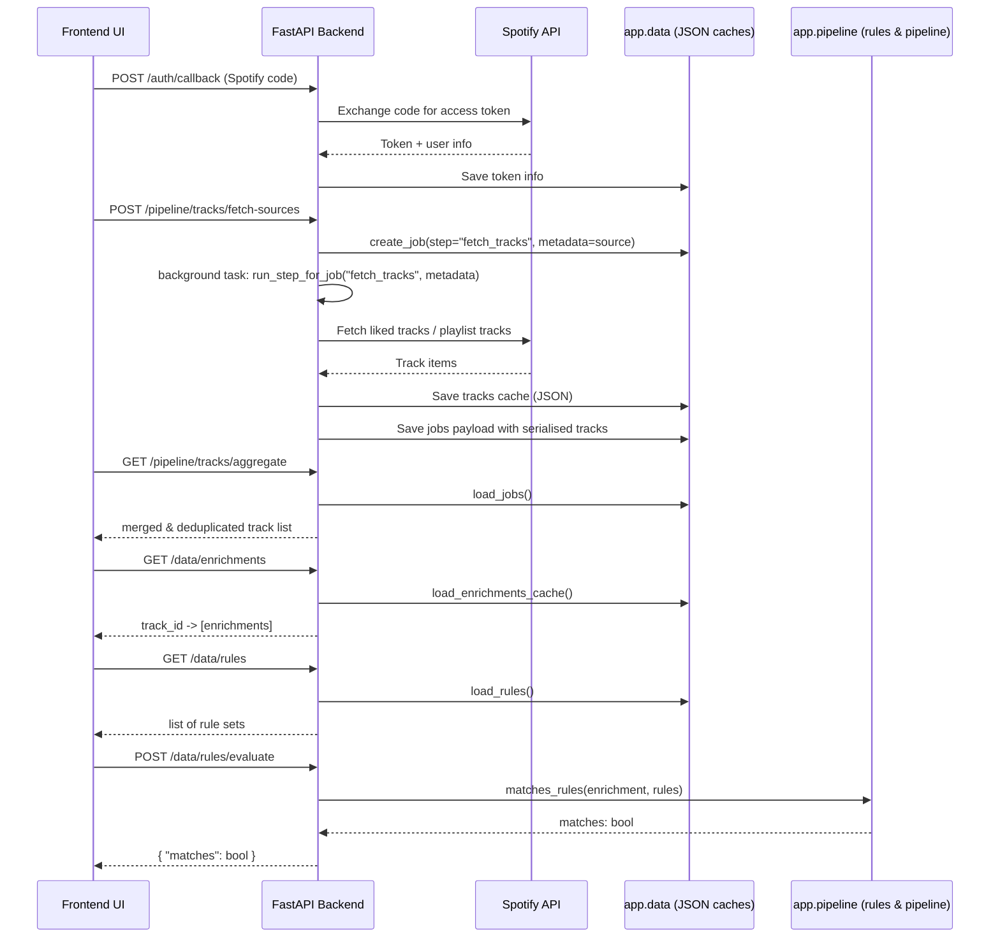

# Data Flow – spotify-auto-playlists

This document describes the end-to-end data flows in the backend, from Spotify to
the internal caches and rules system.

## Overview

The main flow:

1. User authenticates with Spotify.
2. Backend fetches tracks from one or more sources (liked tracks, playlists, etc.).
3. Tracks are cached locally in JSON.
4. External and future enrichers populate the unified enrichment cache.
5. Rules are applied over the enrichment view to build or preview playlists.
6. Async jobs orchestrate long-running operations and expose progress to the UI.

## Mermaid sequence diagram



## Track fetching flow

- The client selects one or more sources (liked tracks, specific playlists).
- Each source is represented as a `TrackSource` with a `source_type` and optional
  `source_id`.
- `POST /pipeline/tracks/fetch-sources` creates one async job per source.
- Jobs run `fetch_tracks_for_source(token_info, source)` and store a serialised
  list of `Track` objects in their payload.
- `GET /pipeline/tracks/aggregate` collects all finished jobs, deduplicates tracks
  by id, and returns:

  ```json
  {
    "tracks": [...],
    "sources": [
      { "source_type": "liked", "source_id": null, "source_label": "Liked tracks" },
      ...
    ]
  }
  ```

This allows the frontend to show source-level progress and a combined track list.

## Enrichment flow

- The `external` pipeline step calls external providers (MusicBrainz, AcousticBrainz)
  to compute features per track.
- External features are saved in their own cache.
- At the same time, the unified enrichment cache is updated via
  `_update_enrichment_cache_from_external()`:

  - For each track:
    - build a `TrackEnrichment` with `source="external_features"`.
    - append it to the per-track list in the enrichment cache.

Future enrichers (LLM-based or manual) will also create `TrackEnrichment` entries
and store them in the same cache file.

## Rules flow

- Rules are defined as `PlaylistRuleSet` instances and stored in `rules.json`.
- CRUD operations on rules:
  - `GET /data/rules` – list rule sets.
  - `POST /data/rules` – create or replace (upsert) a rule set.
- The frontend can evaluate a single rule group against an enrichment mapping via:

  ```http
  POST /data/rules/evaluate
  {
    "rules": { ...RuleGroup... },
    "enrichment": { ...flattened categories... }
  }
  ```

- The backend calls `matches_rules(enrichment, rules)` and returns
  `{ "matches": true|false }`.

In future sprints, this same engine will be used to:

- classify tracks into target playlists based on their enrichment view,
- build playlist previews,
- support fully rule-driven playlist definitions.

## Jobs & async flow

Long-running tasks (track fetching, enrichment, future LLM processing) use the job
system:

- Jobs are represented as `PipelineJob` objects persisted in JSON.
- Each job records:
  - `step`, `status`, `progress`, `message`, `payload`, `metadata`.
- Job lifecycle:
  - `create_job(step=..., metadata=...)` – initial state `PENDING`.
  - background function updates:
    - `status` → `RUNNING` → `DONE` or `FAILED`,
    - `progress` between 0.0 and 1.0,
    - `payload` summarising the result.

The smoke test exercises:

- legacy async jobs (`step="tracks"`),
- multi-source fetch jobs (`step="fetch_tracks"`),
- aggregation endpoints,
- data APIs (enrichments, rules, rule evaluation).

This ensures that the pipeline remains stable across refactors and new features.
