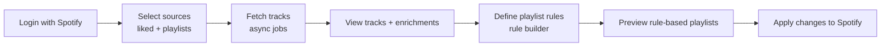

# Frontend Design – spotify-auto-playlists (Planned)

This document describes the **future frontend** and how it will interact with
the current backend. It assumes a **single-page application (SPA)** running
locally next to the FastAPI backend.

The focus is on:

- user journey,
- main screens & components,
- backend endpoints used by each screen,
- how async jobs and rules will be visualised.

---

## 1. User Journey

High-level flow:



---

## 2. Screens & Components

### 2.1 Auth & Setup Screen

Purpose: connect the user’s Spotify account and show quick status.

Components:

- “Connect with Spotify” button:
  - redirects to `/auth/login` (or equivalent auth endpoint).
- Status card showing:
  - connected user name,
  - token validity,
  - short-cut to playlist explorer.
- Error state:
  - display `auth_url` from API (e.g. when endpoints return 401 with auth_url).

Backend endpoints:

- `GET /spotify/playlists` – used to verify token and show a first list of playlists.

> **Note:** The `/spotify/playlists` endpoint is important for the frontend to display and select playlists, but is not covered by the backend smoke test. The API contract for this endpoint must eventually be tested end-to-end to ensure frontend-backend compatibility.

---

### 2.2 Source Selection & Fetch Progress

Purpose: let the user choose where tracks come from and visualise async progress.

UI elements:

- **Sources table / grid**
  - Built from `GET /spotify/playlists` + a synthetic “Liked tracks” row.
  - Columns:
    - “Source” (name or “Liked tracks”),
    - “Owner”,
    - “Track count”,
    - “Include” toggle.

- **“Fetch tracks” action**
  - Gathers selected sources into a payload:

    ```json
    {
      "sources": [
        { "source_type": "liked", "source_id": null, "label": "Liked tracks" },
        { "source_type": "playlist", "source_id": "...", "label": "My Playlist" }
      ]
    }
    ```

  - Calls `POST /pipeline/tracks/fetch-sources` to create one job per source.

- **Per-source progress indicators**
  - For each job:
    - poll `GET /pipeline/jobs/{id}` until `status` is `done` / `failed`,
    - show spinner / progress indicator while in progress,
    - show checkmark on success,
    - show error badge on failure.
  - Optionally, display aggregated status via `GET /pipeline/tracks/aggregate`.

Visual style:

- similar to iOS app install bubbles: each source has an icon with a circular
  progress indicator and a completion state.

---

### 2.3 Tracks & Enrichments View

Purpose: table view of tracks with enrichment status, ready for rule-based work.

Data inputs:

- `GET /pipeline/tracks/aggregate`
  - provides merged track list + sources.
- `GET /data/enrichments`
  - provides a mapping `track_id -> enrichments[]`.
  - frontend flattens or summarises this into per-track indicators.
  - **TrackEnrichment[] is internal storage**: The backend stores enrichments as a list of `TrackEnrichment` entries per track. The rule engine operates on a flattened dictionary view of these enrichments. The frontend can provide its own flattening logic and is not required to use the backend's `TrackEnrichment` model.

Table columns (minimal):

- Track name
- Artist
- Album
- Source badges (liked / playlist labels)
- Enrichment flags per type (e.g. `external_features`, `llm_v1`, `manual`)
  - green when present,
  - grey/red when missing.

Interactions:

- Filtering:
  - text search by track/artist,
  - filter by source (specific playlist),
  - filter by enrichment completeness (“missing external_features”).
- Selection:
  - select all / per row,
  - “select all tracks missing enrichment X”.
- Actions (future):
  - “Enrich selected tracks with provider Y” → triggers new async jobs.

---

### 2.4 Rule Builder UI

Purpose: allow users to define playlist rules (`PlaylistRuleSet`) over enrichments.

Concepts:

- **Rule sets (`PlaylistRuleSet`)**
  - `id`, `name`, `description`, `enabled`,
  - optional `target_playlist_id`,
  - root `RuleGroup` describing conditions.

- **Rule groups (`RuleGroup`)**
  - `operator`: `and` / `or`,
  - list of `RuleCondition` entries.

- **Conditions (`RuleCondition`)**
  - `field`: enrichment key (`"mood"`, `"energy"`, `"genre"`, …),
  - `operator`: `eq`, `between`, `contains`, …,
  - `value`: scalar or collection.

UI layout:

- **Rule list panel**
  - loads rules from `GET /data/rules`,
  - shows each rule with:
    - name,
    - enabled switch,
    - target playlist,
    - last updated (optional),
    - “Edit”, “Duplicate”, “Preview” actions.

- **Rule editor panel**
  - form fields:
    - name, description,
    - target playlist selector (from `GET /spotify/playlists`),
    - enabled flag,
    - rule group:
      - dropdown for operator (`and` / `or`),
      - list of condition rows:
        - field select (pre-populated from known enrichment keys),
        - operator select,
        - value input (text, number, multi-select, etc.).

Backend interactions:

- `GET /data/rules` – load rule sets.
- `POST /data/rules` – upsert rule sets.
  - **POST is always an upsert**: The backend always creates or updates a rule set when receiving a POST. The frontend can safely use POST for both save and update operations.
- `POST /data/rules/validate` – validate rule structure before saving.
- `POST /data/rules/evaluate` – test rules against sample enrichments from
  `/data/enrichments`.

---

### 2.5 Rule-Based Playlist Preview

Purpose: preview the effect of rules before touching Spotify.

Flow:

1. Frontend builds a list of tracks with flattened enrichment views.
2. Sends payload to `POST /pipeline/playlists/preview-from-rules`:

   ```json
   {
     "rules": [ /* PlaylistRuleSet[] */ ],
     "tracks": [
       { "track_id": "id1", "enrichment": { "mood": "happy" } },
       { "track_id": "id2", "enrichment": { "mood": "sad" } }
     ]
   }
   ```

3. Receives `playlists`:

   ```json
   {
     "playlists": [
       {
         "rule_id": "happy_rule",
         "rule_name": "Happy tracks",
         "track_ids": ["id1", "..."],
         "track_count": 42
       }
     ]
   }
   ```

UI:

- **Preview cards / list**
  - one card per rule,
  - shows name, target playlist (if any), track_count,
  - actions:
    - “View tracks” (opens a filtered track table),
    - future: “Bind to Spotify playlist”.

---

### 2.6 Sync & Apply Screen (Future)

Purpose: manage applying rule-based playlists back to Spotify.

Potential design:

- For each rule with a `target_playlist_id`:
  - show a diff between previewed tracks and current playlist contents.
- Let the user:
  - enable/disable applying per playlist,
  - choose “replace contents” vs “incremental update”.
- Use extended backend endpoints built on top of existing
  `/pipeline/build`, `/pipeline/diff`, and `/pipeline/apply` flows.

This phase depends on finalising the UX and guardrails (confirmations,
dry runs, rate limit considerations, etc.).

---

## 3. Frontend Tech Stack (Suggested)

Not strictly enforced by the backend, but a reasonable setup:

- React + TypeScript SPA.
- Router (e.g. React Router) for screens.
- Data fetching via React Query / TanStack Query.
- Component library:
  - shadcn/ui or similar, for tables, forms, dialogs, and badges.
- Global state (optional):
  - Zustand or Redux Toolkit for selected sources, loaded tracks, and
    rule drafts.

The backend’s job is to stay **agnostic** to this choice and expose stable,
well-documented APIs that any modern frontend can consume.
