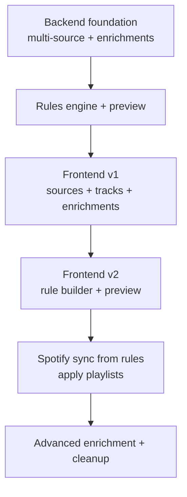

# Product & Technical Roadmap – spotify-auto-playlists

This roadmap captures where the backend is today and how we will reach a
full rule-based, multi-source playlist builder with a dedicated frontend.

It is meant to be **living documentation**: adjust it when sprints complete
or priorities change.

---

## 1. Current Achievements (Baseline)

As of now, the backend provides:

- **Multi-source track fetching**
  - `TrackSource` / `TrackSourceType` abstractions.
  - Async jobs for `fetch_tracks` (one per source).
  - Aggregation endpoint `/pipeline/tracks/aggregate`.

- **Unified enrichment cache**
  - `TrackEnrichment` model.
  - `enrichments.json` storage with atomic JSON writes.
  - `/data/enrichments` endpoint exposing a clean mapping.

- **Rules & Rules Engine**
  - Rules DSL (`PlaylistRuleSet`, `RuleGroup`, `RuleCondition`).
  - Rich operator set (`eq`, `between`, `contains`, `regex`, …).
  - Implementation in `app.pipeline.rules_engine`:
    - `build_enrichment_view`,
    - `matches_rules`.
  - Endpoints:
    - `GET /data/rules`
    - `POST /data/rules` (upsert)
    - `POST /data/rules/evaluate`
    - `POST /data/rules/validate`

- **Rule-Based Playlist Preview**
  - `build_rule_based_playlists` in `playlist_manager`.
  - `POST /pipeline/playlists/preview-from-rules` endpoint.

- **End-to-end smoke test**
  - `scripts/smoke_test.py` exercises:
    - pipeline health,
    - core pipeline steps,
    - async jobs (legacy + `fetch_tracks`),
    - data APIs (tracks, enrichments, rules),
    - rules evaluation, validation, and preview.

---

## 2. Roadmap Overview (Phases)

### Phase A – Backend Foundation (DONE / ONGOING)

- Robust JSON persistence with atomic writes.
- Async job system and `jobs.json` store.
- Spotify integration: liked tracks and playlists.
- Multi-source `fetch_tracks` pipeline step + aggregation endpoint.
- Basic external enrichment (`external_features` step).

### Phase B – Rules Engine & Preview (DONE / ONGOING)

- Rules DSL and engine in `app.core.rules` / `app.pipeline.rules_engine`.
- Rules storage and APIs in `app.data.rules` / `/data/rules` endpoints.
- Validation / evaluation endpoints.
- Rule-based playlist preview endpoint:
  - `POST /pipeline/playlists/preview-from-rules`.

### Phase C – Frontend v1: Sources, Tracks, Enrichments (PLANNED)

- SPA skeleton:
  - Auth / Spotify connection screen.
  - Playlist / sources selection.
- Multi-source fetch UI:
  - one icon per source with async progress.
- Tracks table:
  - built from `/pipeline/tracks/aggregate` + `/data/enrichments`.
  - enrichment flags and source badges.

### Phase D – Frontend v2: Rule Builder & Preview (PLANNED)

- Visual rule builder on top of the DSL.
- Live validation + evaluation:
  - `POST /data/rules/validate`,
  - `POST /data/rules/evaluate`.
- Rule-based playlist preview:
  - integrate `/pipeline/playlists/preview-from-rules`.
- Save and manage rule sets (enable/disable).

### Phase E – Spotify Sync from Rules (PLANNED)

- Extend backend to apply rule-based previews to Spotify:
  - use existing `build/diff/apply` machinery,
  - or specialised endpoints that take rule-based previews as input.
- Safety features:
  - dry-run diff views,
  - explicit confirmation before applying many changes,
  - retry / error reporting.

### Phase F – Advanced Enrichment & Cleanup (PLANNED)

- New enrichment providers:
  - local LLM-based enrichers,
  - remote LLM-based enrichers,
  - manual tagging from the frontend.
- Shared enrichments:
  - treat enrichments as **global per track** across users,
    while keeping manual labels and custom playlists user-specific.
- Cleanup sprints:
  - remove legacy pipeline endpoints once the new flows are stable,
  - harmonise naming (e.g. “external_features” vs “enrichments”),
  - tighten module responsibilities and remove dead code,
  - ensure documentation and coding guidelines reflect the final shape.

---

## 3. Example Sprint Breakdown

These are illustrative sprints that can be adjusted to your pace.

### Sprint N – Solidify Rules & Preview

- Finalise operator set and semantics in `rules_engine`.
- Extend smoke tests for more complex rule combinations.
- Refresh `docs-rules_engine.md` and `docs-api_rules.md`.

### Sprint N+1 – Frontend v1 Skeleton

- Implement SPA shell (routing, basic layout).
- Implement auth / Spotify connection screen.
- Implement source selection and “Fetch tracks” flow.
- Show per-source async job icons and a basic tracks table.

### Sprint N+2 – Rule Builder UX

- Rule list and editor UI.
- Integrate `GET/POST /data/rules` for persistence.
- Wire up `/data/rules/validate` and `/data/rules/evaluate` for live feedback.
- Show “Matches X tracks” indicator in the rule editor.

### Sprint N+3 – Playlist Preview & Diff

- Integrate `POST /pipeline/playlists/preview-from-rules`.
- Card-based playlist preview with track counts and drill-down.
- Design and prototype diff views with existing Spotify playlists.

### Sprint N+4 – Apply from Rules

- Backend endpoints to convert rule-based previews into real Spotify playlist
  operations.
- End-to-end UI flow: rules → preview → diff → apply with confirmation.
- Expand smoke test and/or add integration tests for apply flows.

### Sprint N+5 – Enrichment Extensions & Cleanup

- Implement at least one additional enrichment provider (LLM / manual).
- Update enrichment APIs and UI to surface new categories.
- Dedicate time for codebase cleanup:
  - remove unused endpoints,
  - align naming and architecture with actual usage,
  - reduce redundancy in documentation.

---

## 4. Maintaining the Roadmap

- After each significant sprint:
  - update the “Current Achievements” section,
  - move items from PLANNED to DONE,
  - add important architectural decisions or constraints.
- Keep the roadmap concise:
  - high-level here,
  - deep technical details in the backend / frontend / rules docs.
